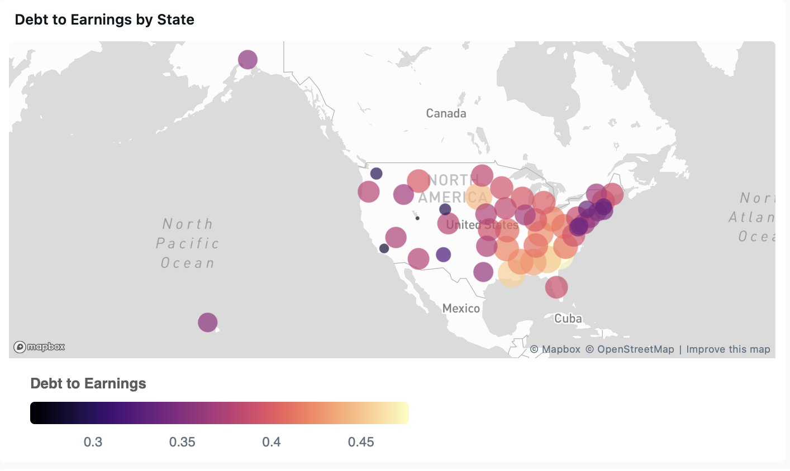
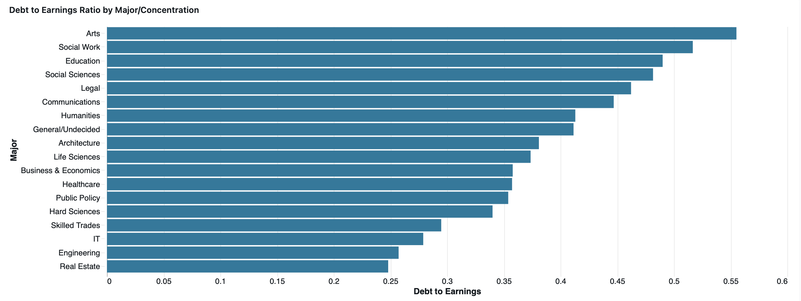

# College Scorecard
* Built in Databricks using SQL
* Data Source: Department of Education Most Recent of Institution-Level Data and Field of Study
* **[View Full Databricks Notebook](./notebook.ipynb)** to see process and code

## Select Visualizations

